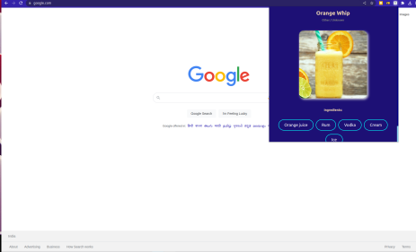

# Cockatoo

This is a chrome extension that helps you quench your thirsts by suggesting you exciting cocktails on every click. You can also try them on your own following the recipes giving to you along with it. 

Try now.




<br>
<br>

## Direct use

You can directly use the extension after cloning the repo and following the steps mentioned [here](https://www.freecodecamp.org/news/building-chrome-extension/) in the **Manifest.json** section. You can also create your own extension if you follow the steps written in there.

To install it in your browser, in the extensions Toolbar on chrome, select `Load unpacked` (while the developer options are on) and select the *extensions* folder from the cloned repo. Now you are ready to use the extension.     
<br><br><br>

## next-chrome

`next-chrome` is a [Next.js](https://nextjs.org/) starter project to bootstrap a new Chrome extension.

[Helpful Tips for Starting a Next.js Chrome Extension | CSS-Tricks](https://css-tricks.com/nextjs-chrome-extension-starter/)

```sh
cd next-app

yarn # run once

yarn build # on macOS
yarn build:linux # on Linux
```


